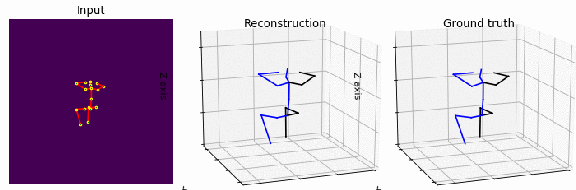

### Back to the Future: Joint Aware Temporal Deep Learning 3D Human Pose Estimation


We propose a new deep learning network that introduces a deeper CNN channel filter and constraints as losses to reduce joint position and motion errors for 3D video human body pose estimation.  Our model outperforms the previous best result from the literature based on mean per-joint position error, velocity error, and acceleration errors on the Human 3.6M benchmark corresponding to a new state-of-the- art mean error reduction in all protocols and motion metrics. Mean per joint error is reduced by 1%, velocity error by 7% and acceleration by 13% compared to the best results from the literature. Our contribution increasing positional accuracy and motion smoothness in video can be integrated with future end to end networks without increasing network complexity.

**Contribution** Joint constraints as losses with an updated temporal CNN architecture.
Generalizable state of the art results on [Human3.6M](http://vision.imar.ro/human3.6m/description.php)

**Paper** First Author, CVPR 2020 *Submitted* - arxiv TBD

|                   | Protocol #1   | Protocol #2   | Protocol #3  |
| ------------------| ------------- |---------------|--------------|
| [Pavvllo '19](https://arxiv.org/abs/1811.11742) (CVPR) | 46.8          | 36.5          | 44.9         |
| [Chen'19](https://arxiv.org/abs/1904.05547) (CVPR)    | 46.8          | 41.6          | 50.3         |
| Ours              | 45.9          | **35.9**      | **44.2**     |

|                   | Velocity      | Acceleration   |
| ------------------| ----------- --|----------------|
| [Pavvllo '19](https://arxiv.org/abs/1811.11742) (CVPR) | 2.83          | 2.44           |
| Ours              | **2.63**      | **2.12**       | 


This work extends Pavllo '19 FAIR [VideoPose3D](https://github.com/facebookresearch/VideoPose3D)

**Requirements**
CUDA + 
Follow instructions at [VideoPose3D](https://github.com/facebookresearch/VideoPose3D)

```
pip3 install vg  # vector calculations (really shouldn't be needed)
pip3 install numpy==1.16.2 # pickle breaks later numpy releases
python run.py -e 80 -ch 2048 -k cpn_ft_h36m_dbb -arc 3,3,3,3,3 -bm #run with -ch 2048  and -bm flag ie:
```

**Model**
1.1 GB - please contact to download. 
